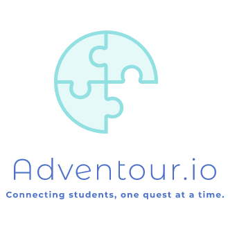
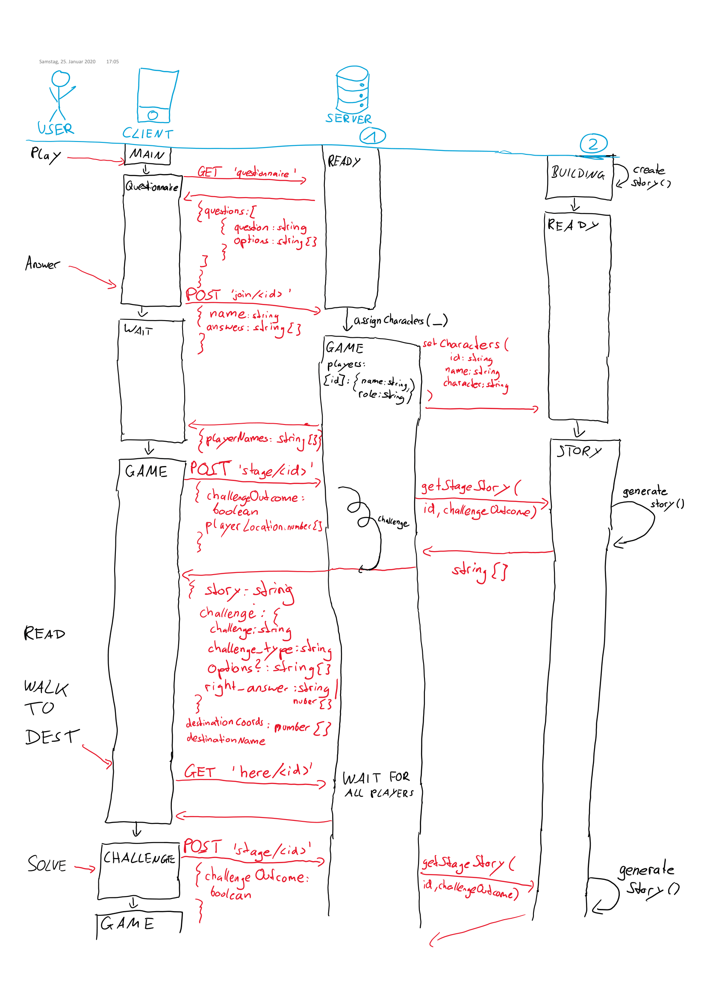
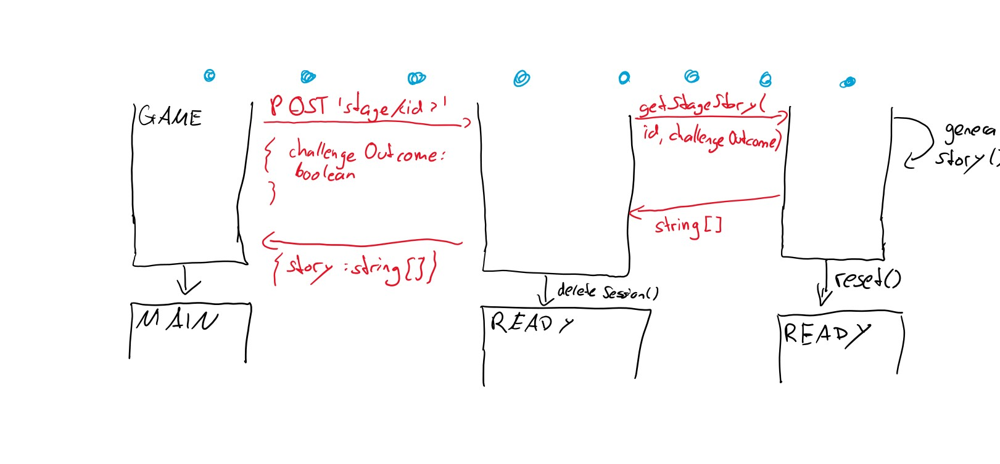

# Komputer & Kreativität WS 19/20
# <span>Adventour</span>.io

##### Gruppe 3
| Agata Łabiak            | Esteban Vindas Prado      | Linus Kreitner               | Rania           | Sarah Shtaierman         |
|-------------------------|---------------------------|------------------------------|-----------------|--------------------------|
| Backend, Challenge Creator | Backend, Documentation | Frontend, Fullstack | Story Writer, UI | Backend, Story Architect |

### Documentation
The project is devided into two subprojects:
1. Click [here](https://gitlab.ldv.ei.tum.de/komcrea/g3-19/tree/master/frontend) to learn more about the **frontend** part.
2. Click [here](https://gitlab.ldv.ei.tum.de/komcrea/g3-19/tree/master/backend) to learn more about the **backend** part.

If you do not want to have a preview without installing anything, checkout the [Preview section](https://gitlab.ldv.ei.tum.de/komcrea/g3-19/tree/master/preview)

### Run <span>Adventour.io</span>
To install the necessary dependencies please read the related install guides.
1. Run the server:
    ```sh
    cd backend
    python server.py
    ```
2. Run the client:
    ```sh
    cd frontend
    ionic serve
    ```
*Note: Running the program like this is for development only! Do not use it in a production deployment!*

**Note: The default mode is the demo mode. Meaning, that the server will provide 3 dummy players to enable you to test the app alone. However, this also fixates decisions that would otherwise be made by real players and therefore makes the story and choice of sights more deterministic!**
### Useful links

- Trello:
https://trello.com/b/yoNO9tfS/app

- Google Docs folder:
https://drive.google.com/drive/u/0/folders/1qBbCgx-RU_e7bNJ9J5aTeSQnd-tI1meb

- Figma Design Mockup:
https://www.figma.com/file/XkdP2xKKd4rKfD4lgpHHbL/Adventour.io?node-id=0%3A1

### Server-Client Communication


