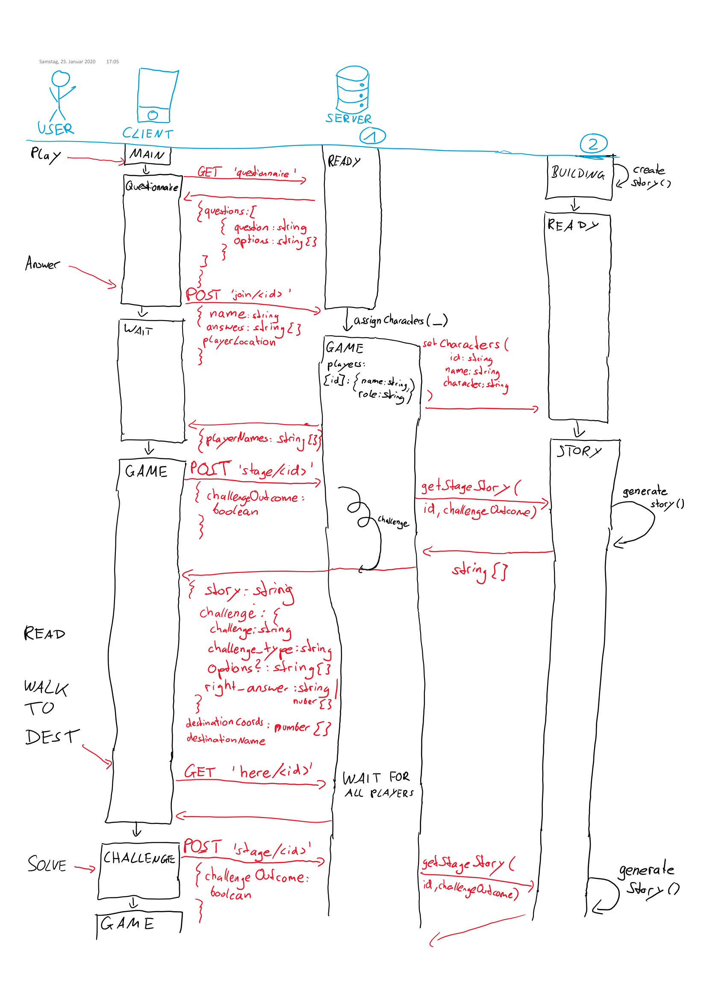
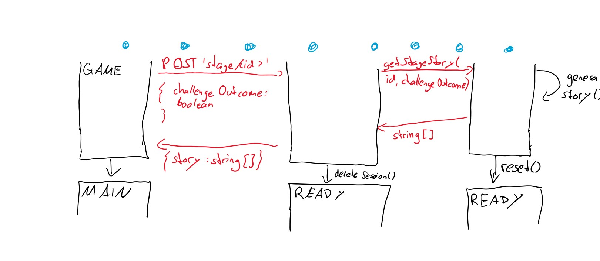

# Komputer & Kreativität WS 19/20
# <span>Adventour</span>.io
*Make new friends on a personalized narrative-driven city quest!*
##### Gruppe 3
| Agata Łabiak            | Esteban Vindas Prado      | Linus Kreitner               | Rania           | Sarah Shtaierman         |
|-------------------------|---------------------------|------------------------------|-----------------|--------------------------|
| Story Building, Backend | Full Stack, Documentation | Mobile Development, Frontend | UX/UI, Frontend | Story Architect, Backend |

### Documentation
The project is devided into two subprojects:
1. Click [here](https://gitlab.ldv.ei.tum.de/komcrea/g3-19/tree/master/frontend) to learn more about the **frontend** part.
2. Click [here](https://gitlab.ldv.ei.tum.de/komcrea/g3-19/tree/master/backend) to learn more about the **backend** part.

### Run <span>Adventour.io</span>
To install the necessary dependencies please read the related install guides.
1. Run the server:
    ```sh
    cd backend
    python server.py
    ```
2. Run the client:
    ```sh
    cd frontend
    ionic serve
    ```
*Note: Running the program like this is for development only! Do not use it in a production deployment!*
### Useful links

- Trello:
https://trello.com/b/yoNO9tfS/app

- Google Docs folder:
https://drive.google.com/drive/u/0/folders/1qBbCgx-RU_e7bNJ9J5aTeSQnd-tI1meb

- Figma Design Mockup:
https://www.figma.com/file/XkdP2xKKd4rKfD4lgpHHbL/Adventour.io?node-id=0%3A1

### Server-Client Communication


