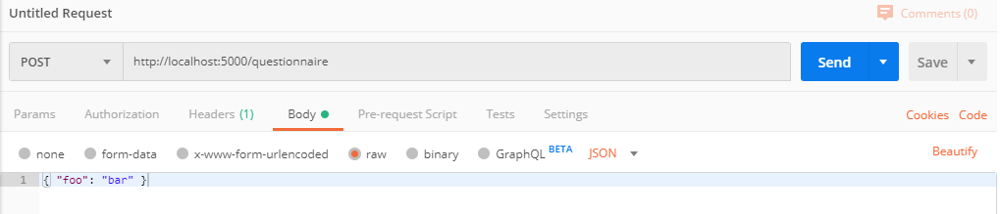

# Backend

### Introduction

The backend project is the server implentation of our application. It uses Flask to provide an easy to understand python-based server implementation. Flask is a lightweight WSGI web application framework. It is designed to make getting started quick and easy, with the ability to scale up to complex applications.

### Local Development
##### Prerequisites
1. [Python 3](https://www.python.org/downloads/)
    Download the latest version of python and make sure to set the PATH variable accordongly. Verify your installation by running this command from a command line:
    ```sh
    python -V
    
    # check if pip is installed

    pip -V
    ```
2. Dependencies
    You can install all other dependencies by running:
    ```sh
    pip install -r requirements.txt
    ```

    *If you add new dependencies in the future make sure to also add them to the requirements.txt file!*

##### Running the server
You can start the server by running:
```sh
python server.py
```

You can now open your browser and navigate to `http://localhost:5000`

#### Test the REST endpoints
You can easily test the server API without using the frontend. For this we recommend using the freeware program [Postman](https://www.getpostman.com/).


1. Run the server.
2. Select either GET or POST.
3. For **server url** use `http://localhost:5000/` and append the endpoint you want to querry, e.g. `http://localhost:5000/join/12345`.
4. You can also define a **body** for POST requests. Set the **content type** to `raw` and select `JSON`.
5. After you click send the response of the request should be displayed below.
*NOTE: You can see possible server errors in the console where the server was started!*

You can also send GET or POST request with the command line using `curl`. The equivalent of the example above would be:
```bash
curl -i -X POST -H 'Content-Type: application/json' -d '{"foo": "bar"}' http://localhost:5000/questionnaire
```

Also note that if you access a given url with your webbrowser, it implicitly performs a GET request and displays the returned content.

### JSON files

#### places 

Places are grouped into three categories, Entertainment, University, Sightseeing. Each category further divided into three stages (as for now for, stage 0 is meant as a buffer stage for places I haven't found a challenge for yet. Feel free to change it if you get an idea).
